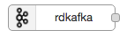
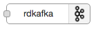
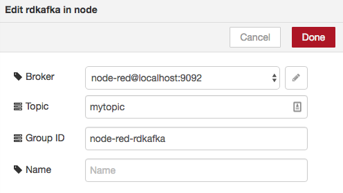
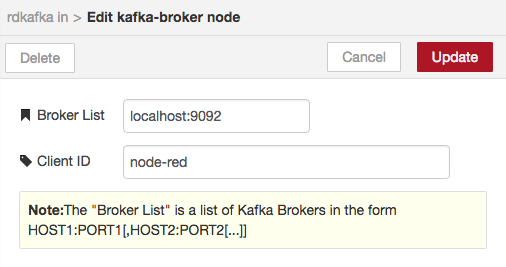

node-red-contrib-rdkafka
========================

Node-RED (http://nodered.org) nodes for publish/subscribe messaging using the new Apache Kafka Consumer/Producer API and without requiring direct communications with Zookeeper. Based on the the high performance librdkafka Apache Kafka C/C++ library (https://github.com/edenhill/librdkafka).

# Features

* Up to date support for Apache Kafka 0.9, 0.10, and 0.11 including Confluent version 2.x and 3.x
* High performance through use of librdkafka C/C++ library (see https://github.com/edenhill/librdkafka) 
* Up to date feature set from use of node-rdkafka node.js client (see https://github.com/Blizzard/node-rdkafka)
* Tested on Linux, macOS, and Raspberry Pi / Raspbian Jessie
* Supports dynamic topic selection via incoming msg.topic value
* Supports dynamic partition selection via incoming msg.partition value
* Supports event time timestamps (with Kafka 0.10+) via msg/timestamp value
* Uses `auto.offset.commit` to commit consumers offsets 

# Install

Run the following command in the root directory of your Node-RED install (typically ~/.node-red)

    npm install node-red-contrib-rdkafka

You may see a lot of warnings as librdkafka compiles and installs, particularily on MacOS, but it does work.

Start node-red as normal or with `-v` for better debugging

	node-red -v

Point your browser to http://localhost:1880

You should see white rdkafka input and output nodes in the pallet on the left side of the screen.
<ul>
    
    
</ul>

Drag either rdkafka node to the canvas and double click to configure the Kafka topic, brokers, clientID and groupID.

Click on the pencil icon to the right of the broker selection box to configure a kafka broker connection if one does not already exist.

Publish and subscribe just as you would with the mqtt node with some small differences namely:
<ul>
	<li>topics should not contain "/" or "." characters
	<li>kafka wildcard/regex subscriptions are not yet fully tested
	<li>ensure you have unique Group IDs configured unless you want multiple consumers to be in a Kafka consumer group
</ul>

# Author

Hans Jespersen, https://github.com/hjespers

# Feedback and Support

For more information, feedback, or support see https://github.com/hjespers/node-red-contrib-rdkafka/issues
